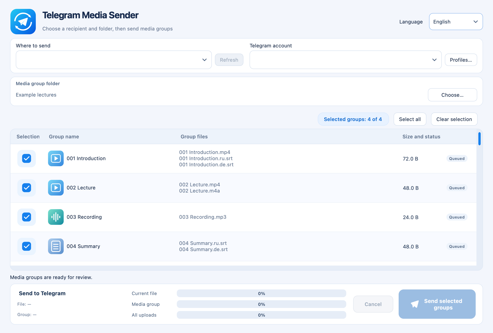

# Telegram Media Sender


**[Download for macOS](https://github.com/popovantondev/TelegramMediaSender/releases/latest)** · **[Deutsch](docs/de/README.md)** · **[Русский](docs/ru/README.md)** · **[English](docs/en/README.md)**

Apple Silicon (M1 or newer) · macOS 13+ · Version 1.1.2

**Telegram Media Sender** is a desktop app for macOS that sends ordered batches of local files to Telegram chats. A numbered bundle may contain video, audio, subtitles, or any combination of them. The app lists chats where the signed-in account can post, lets you select bundles, and shows upload progress.

The interface selects German, Russian, or English from the macOS language on first launch. You can choose another language in the window; restart the app to apply it. The window position is remembered.



*Application interface rendered with demonstration files. No Telegram account is connected; no files were uploaded.*

## What you can send

| Use case | Example files | Result |
| --- | --- | --- |
| Lecture recordings | `001 Introduction.mp4`, `002 Lecture.mp4` | Two bundles, sent in numeric order |
| Video and separate audio | `003 Lecture.mp4`, `003 Lecture.m4a` | One bundle with both files |
| Video with subtitles | `004 Lesson.mp4`, `004 Lesson.ru.srt`, `004 Lesson.de.srt` | One bundle with video and subtitles |
| Subtitles only | `005 Notes.ru.srt`, `005 Notes.de.srt` | One subtitle-only bundle |

## Downloads

Download the Apple Silicon build for macOS 13 or later from [Releases](https://github.com/popovantondev/TelegramMediaSender/releases). The current version is **1.1.2**. Unzip the download and move **Telegram Media Sender.app** to Applications.

The build is not notarized by Apple. Follow the first-launch instructions in the [user guide](docs/en/README.md). For local development, the packaged app is at `dist/TelegramMediaSender-1.1.2-macOS-arm64/Telegram Media Sender.app`.

## Quick start

1. Install a release build and open **Telegram Media Sender**.
2. Create a Telegram API application and add its API ID and API Hash to a profile. Follow [Telegram connection setup](docs/en/telegram-setup.md).
3. Enter the login code Telegram sends to your account, and your two-step verification password if prompted.
4. Choose a folder containing numbered files, load your chats, select the destination and groups, and send.

The app does not contain API keys or a Telegram account. Profile data and Telegram sessions are stored in the app's own folder under `~/Library/Application Support/TelegramMediaSender`. The profile selector is empty until a named profile exists. On first launch, explicitly named compatible profiles and their SQLite sessions from the earlier Telegram Archive sender are copied into this folder; the earlier app's data is preserved. The old app's unnamed default account is not added automatically. Profiles can be removed with **Profiles… → Delete…**. A session file is sensitive: anyone who obtains it may be able to access the Telegram account. Do not share it or upload it to this repository.

## Supported folder layout

Give related files the same leading number to place them in one bundle. Bundles are sent in numeric order. For example:

```text
001 Lesson.ru.mp4
001 Lesson.ru.srt
001 Lesson.de.srt
001 Lesson alternate.srt
```

Supported media: MP4, M4V, MOV, MKV, WebM, AVI, M4A, MP3, AAC, OGG, WAV, and FLAC. A bundle can also contain only media or only `.srt` subtitles. Subtitle names may differ slightly; files with the same leading number are grouped together. All matching subtitles are included, and the app warns when several files match one language. Before uploading, the app compares file names and sizes against the selected chat history and asks what to do when it finds a possible match.

## Technology

- Python 3.12+
- PySide6 / Qt for the macOS desktop interface
- Telethon for Telegram's MTProto API
- PyInstaller for standalone macOS packaging

## Build from source

On macOS with Xcode Command Line Tools and Python 3.12 installed:

```bash
git clone https://github.com/popovantondev/TelegramMediaSender.git
cd TelegramMediaSender
bash scripts/build_macos.sh
```

The app bundle is written to `dist/`. See the developer notes in [English](docs/en/development.md), [Deutsch](docs/de/development.md), or [Русский](docs/ru/development.md).

## Documentation

- [Deutsch](docs/de/README.md) · [Telegram verbinden](docs/de/telegram-setup.md)
- [Русский](docs/ru/README.md) · [Подключение Telegram](docs/ru/telegram-setup.md)
- [English](docs/en/README.md) · [Connect Telegram](docs/en/telegram-setup.md)
- [Changelog](CHANGELOG.md)

## Feedback

[Report a bug or suggest a feature](https://github.com/popovantondev/TelegramMediaSender/issues/new/choose). You can write in English, German or Russian. Include your app version and macOS version; remove personal details from screenshots.

[Release verification and another-Mac checklist](docs/release-check.md).

## Rights and third-party software

This project has no open-source license. Public availability does not grant permission to reuse, modify, redistribute, or sell its source. The release binary may be downloaded and run for personal use. See [RIGHTS.md](RIGHTS.md) and [third-party notices](THIRD_PARTY_NOTICES.md).
