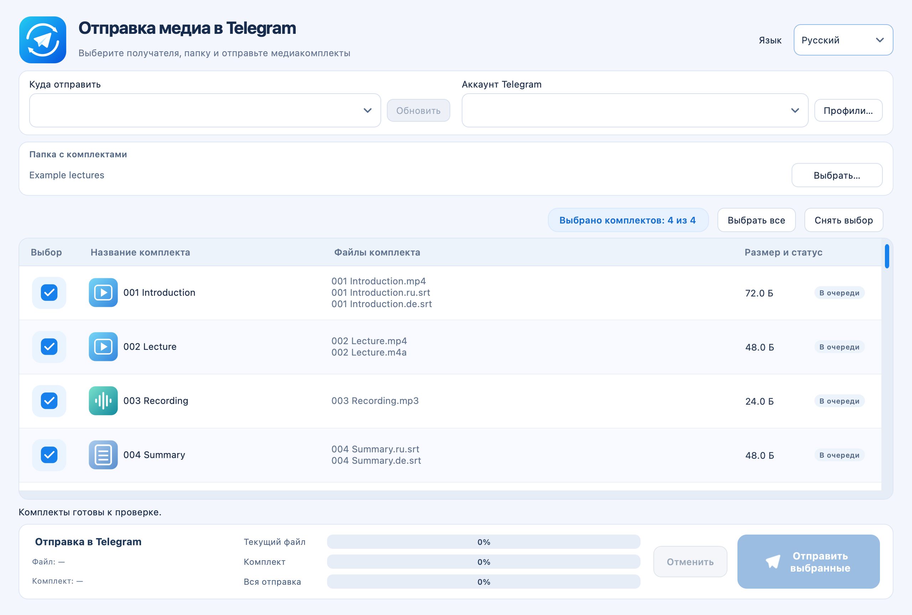

# Руководство пользователя

[Руководство пользователя](https://popovantondev.github.io/TelegramMediaSender/Guide-ru.html)

**[Скачать для macOS](https://github.com/popovantondev/TelegramMediaSender/releases/latest)** · [Deutsch](../de/README.md) · [Русский](../ru/README.md) · [English](../en/README.md)

*Интерфейс с демонстрационными файлами; аккаунт Telegram не подключён.*

Telegram Media Sender отправляет из локальной папки пронумерованные комплекты файлов в выбранный чат Telegram. Комплект может содержать видео, аудио, субтитры или любое их сочетание. Программа не скачивает историю архива.

## Первый запуск

1. Скачайте ZIP из GitHub Releases, распакуйте его и переместите приложение в «Программы».
2. Откройте приложение. Сборки не нотариально заверены. Если Gatekeeper блокирует запуск, проверьте, что приложение скачано со страницы Releases этого проекта, затем откройте **Системные настройки → Конфиденциальность и безопасность → Открыть всё равно**, только если доверяете источнику.
3. Добавьте профиль со своим номером Telegram, API ID и API Hash. Подробности — в инструкции [Подключение Telegram](telegram-setup.md).
4. Введите код входа, присланный Telegram, а при запросе — пароль двухэтапной проверки.
5. Загрузите список чатов, выберите чат и папку, отметьте комплекты и отправьте их.

## Подготовка комплектов

Файлы с одинаковым номером в начале имени составляют один комплект, например `001 Урок.ru.mp4`, `001 Урок.ru.srt` и `001 Урок.de.srt`. Комплекты отправляются по порядку номеров. Допустимы только видео, только аудио, только субтитры и видео со звуком без субтитров. Небольшие различия в именах субтитров допустимы. Если одному языку подходят несколько файлов, будут отправлены все; программа предупредит об этом.

Перед отправкой программа проверяет историю выбранного чата на файлы с совпадающими именами и размерами. Проверьте найденные совпадения и выберите, пропустить комплект, отправить его повторно или отменить операцию. Медиафайлы отправляются последовательно, субтитры — отдельными документами.

## Локальные данные

Профили и файлы сессий хранятся на этом Mac в `~/Library/Application Support/TelegramMediaSender/MediaGroupSender`. Пока нет профиля с заданным именем, список профилей пуст. Именованные профили старой программы могут быть перенесены один раз; её безымянный стандартный аккаунт автоматически не добавляется. Локальный файл профиля доступен только вашей учётной записи macOS; приложение не загружает эти данные. Файл `.session` следует считать паролем: не передавайте и не загружайте его. Если есть подозрение, что сессия скопирована, завершите её в настройках активных устройств Telegram.

При первом запуске язык выбирается по языку macOS, если он немецкий, русский или английский. Выберите другой язык в окне программы и перезапустите приложение. Положение окна запоминается локально.
